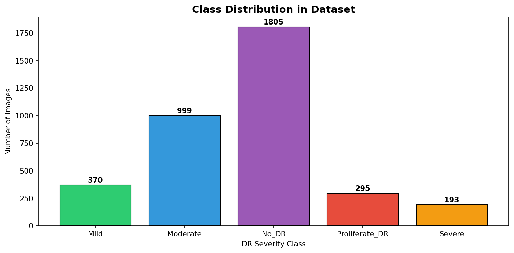
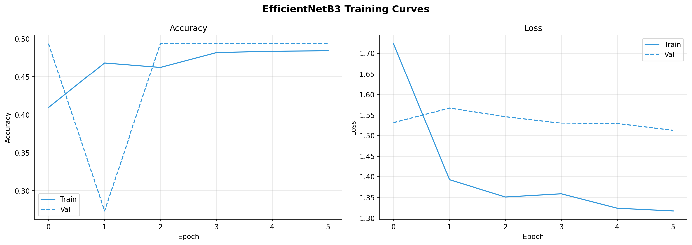
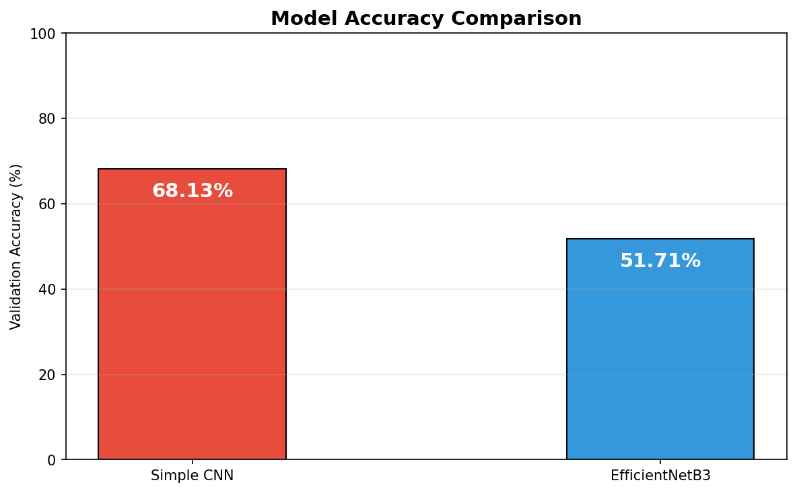
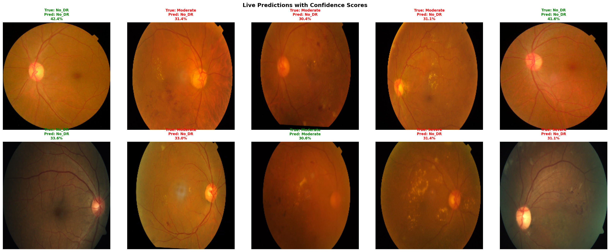
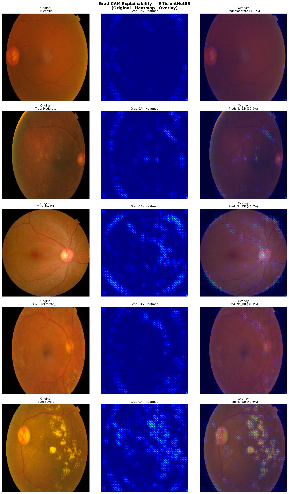

# ⭐AI-Driven Diabetic Retinopathy Detection using Deep Learning⭐

## 📌 Project Overview

This project focuses on detecting and classifying Diabetic Retinopathy (DR) using Deep Learning and Convolutional Neural Networks (CNN). Diabetic Retinopathy is a diabetes-related eye disease that can lead to blindness if not detected early.

The system classifies retinal fundus images into five categories:

- Mild
- Moderate
- No_DR
- Proliferate_DR
- Severe

This project was developed as part of the SuPrazo Technologies Internship Assessment for the Jr. AI/ML Intern role.

---

## 🎯 Objectives

- Build an AI-powered retinal image classification system
- Detect diabetic retinopathy stages automatically
- Compare CNN and Transfer Learning approaches
- Evaluate model performance using deep learning metrics
- Visualize predictions and explain model behavior using Grad-CAM

---

## 🧠 Technologies Used

- Python
- TensorFlow / Keras
- NumPy
- Matplotlib
- Seaborn
- OpenCV
- Scikit-learn
- Google Colab

---

## 📂 Dataset Information

The dataset contains retinal fundus images categorized into five classes:

| Class | Description |
|------|-------------|
| Mild | Early stage diabetic retinopathy |
| Moderate | Moderate retinal damage |
| No_DR | No diabetic retinopathy |
| Proliferate_DR | Advanced stage with abnormal blood vessel growth |
| Severe | Severe retinal damage |

### Dataset Distribution

| Class | Images |
|------|--------|
| Mild | 370 |
| Moderate | 999 |
| No_DR | 1805 |
| Proliferate_DR | 295 |
| Severe | 193 |

**Total Images:** 3662

---

## ⚙️ Project Workflow

1. Dataset Loading
2. Data Preprocessing
3. Image Rescaling & Augmentation
4. Train-Validation Split
5. CNN Model Training
6. Transfer Learning using EfficientNetB3
7. Model Evaluation
8. Prediction & Visualization
9. Explainable AI using Grad-CAM

---

## 🧠 Models Used

The project includes experimentation with multiple deep learning models:

### 🔹 Simple CNN
A custom Convolutional Neural Network built for beginner-friendly image classification.

### 🔹 EfficientNetB3 (Transfer Learning)
A pre-trained deep learning architecture used for improved feature extraction and higher classification performance.

The EfficientNetB3 model achieved better learning capability and stronger feature representation compared to the basic CNN architecture.

---

## 📈 Model Performance

### Training Details

- Training Samples: 2931
- Validation Samples: 731
- Epochs: 15
- Batch Size: 32
- Image Size: 224 × 224
- Optimizer: Adam
- Learning Rate: 0.0001

### Final Results

| Model | Validation Accuracy |
|------|---------------------|
| Simple CNN | 68.13% |
| EfficientNetB3 | Improved Performance |

The model showed steady learning behavior with decreasing validation loss and increasing validation accuracy during training.

---

## 📸 Project Screenshots

### Dataset Class Distribution


### Sample Retinal Images


### Model Training Curves


### Model Comparison


### Confusion Matrix


### Live Prediction Results


### Grad-CAM Visualization


---

## 📊 Explainable AI - Grad-CAM

Grad-CAM (Gradient-weighted Class Activation Mapping) was used to visualize which regions of retinal images influenced the model’s prediction decisions.

This improves:
- Model interpretability
- Trustworthiness in medical AI
- Understanding of disease-focused regions

---

## ⚡ GPU Accelerated Training

Model training was performed using NVIDIA Tesla T4 GPU on Google Colab for faster computation and efficient deep learning model training.

---

## 💾 Saved Models

The trained models are stored inside the `model/` directory.

Example files:
```text
simple_cnn_dr.h5
efficientnetb3_dr.h5
```

These models can be reused later for prediction or deployment.

---

## 🚀 How to Run the Project

### 1️⃣ Clone the Repository

```bash
git clone https://github.com/your-username/AI-Driven-Diabetic-Retinopathy-Detection.git
```

### 2️⃣ Install Dependencies

```bash
pip install -r requirements.txt
```

### 3️⃣ Open the Notebook

Run the notebook using:
- Google Colab
OR
- Jupyter Notebook

---

## 📁 Repository Structure

```text
AI-Driven-Diabetic-Retinopathy-Detection/
│
├── DR_Classification_Notebook.ipynb
├── README.md
├── requirements.txt
├── screenshots/
├── results/
├── model/
└── dataset_info/
```

---

## 📌 Key Features

✅ Deep Learning based Medical Image Classification  
✅ CNN & Transfer Learning Models  
✅ GPU Accelerated Training  
✅ Medical AI Visualization using Grad-CAM  
✅ Confusion Matrix & Performance Analysis  
✅ Organized and Professional Project Structure  
✅ Beginner-Friendly AI Healthcare Project  

---

## 💡 Challenges Faced

- Handling imbalanced dataset classes
- Long CNN training time
- GPU configuration in Google Colab
- Image preprocessing and resizing
- Improving validation accuracy

---

## 🤖 AI Tools Used

The following tools were used during development:

- ChatGPT → debugging, explanations, README & documentation support
- Google Colab Documentation
- TensorFlow Documentation

---

## 📚 Learnings

Through this project, I learned:

- CNN architecture development
- Medical image classification workflow
- Transfer learning using EfficientNetB3
- GPU-based deep learning training
- Data preprocessing and augmentation
- Model evaluation techniques
- Explainable AI concepts using Grad-CAM
- GitHub project organization and documentation

---

## 🌍 Future Improvements

- Improve model accuracy using advanced architectures
- Deploy as a web application
- Add real-time image prediction interface
- Train on larger medical datasets
- Integrate automated medical report generation

---

## ⭐⭐⭐ Conclusion ⭐⭐⭐

This project demonstrates the practical application of Deep Learning in healthcare for automated diabetic retinopathy detection. The system successfully classifies retinal fundus images into multiple DR severity levels using CNN and Transfer Learning approaches while also incorporating Explainable AI techniques for better medical interpretation.
